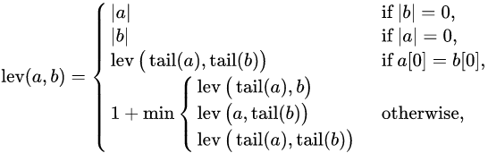
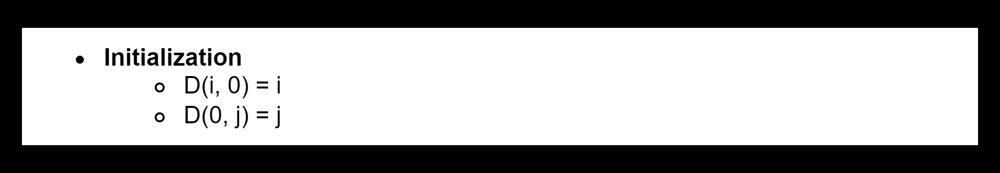
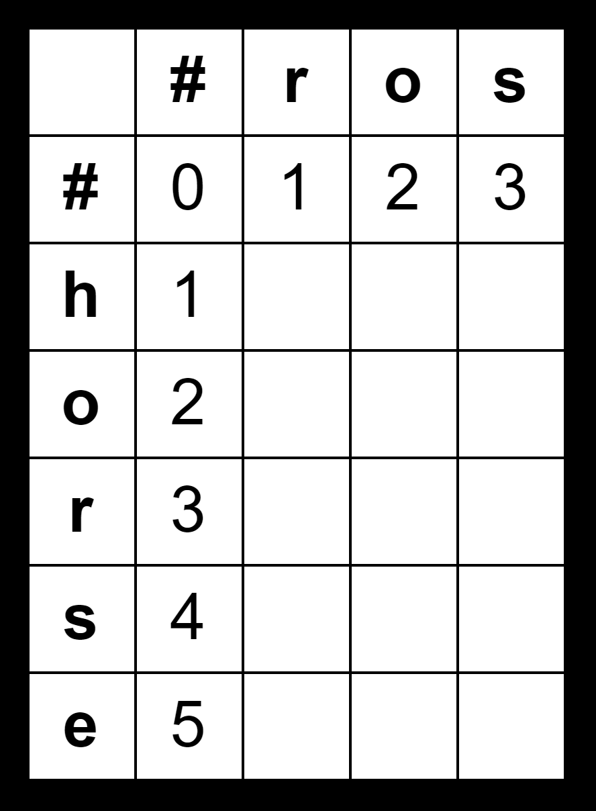
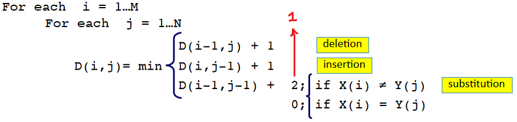
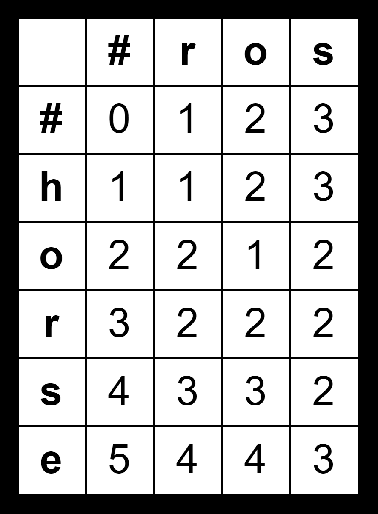

# [Levenshtein Distance]('https://web.stanford.edu/class/cs124/lec/med.pdf')

### Definition

The Levenshtein distance between two strings `a` , `b` (of length | `a` | and | `b` | respectively) is given by `lev(a,b)` where



where the `tail` of some string `x` is a string of all but the first character of `x`, and `x[n]` is the `nth` character of the string `x`, counting from `0`.

Note that the first element in the minimum corresponds to deletion (from `a` to `b`), the second to insertion and the third to replacement.

This definition corresponds directly to the naive recursive implementation.

## Steps

#### Initialization



First we need to create a 2D array of size `n` and `m` where `n` is the number of characters in `word1` + `1` and `m` is the number of characters in `word2` + `1`.

Then, we will loop through the first column and row of the array and initialize them to there index with respect to `n` for row and `m` for column.



### Find the Distance



The above figure is the for loop that will be used to find the distance. In this case though we have to replace the `2` with `1` so that we can keep track of how many edits we did.



### Result

- **`D(m,n)`** is the distance, in this example it's `3`

### Code

- **[Java](./Solution.java)**

```java
class Solution {
    public int minDistance(String word1, String word2) {
        int row = word1.length();
        int col = word2.length();
        int[][] ed = new int[row + 1][col + 1];
        for(int i = 0; i <= row; i++)
            ed[i][0] = i;
        for(int j = 0; j <= col; j++)
            ed[0][j] = j;
        for(int i = 1; i <= row; i++) {
            for(int j = 1; j <= col; j++) {
                if(word1.charAt(i - 1) == word2.charAt(j - 1)) {
                    ed[i][j] = ed[i - 1][j - 1];
                } else {
                    int dia = ed[i - 1][j - 1];
                    int hor = ed[i][j - 1];
                    int ver = ed[i - 1][j];
                    if(dia <= hor && dia <= ver)
                        ed[i][j] = dia;
                    else
                        ed[i][j] = ver < hor ? ver : hor;
                    ed[i][j]++;
                }
            }
        }
        return ed[row][col];
    }
}
```

### Complexity

- **Time:** `O(n * m)`
- **Space:** `O(n * m)`
