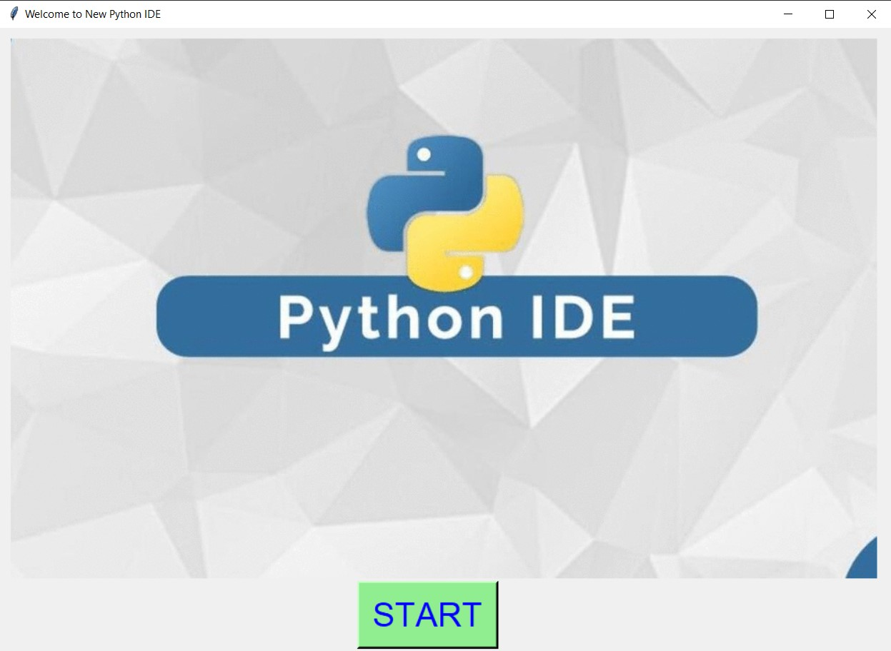
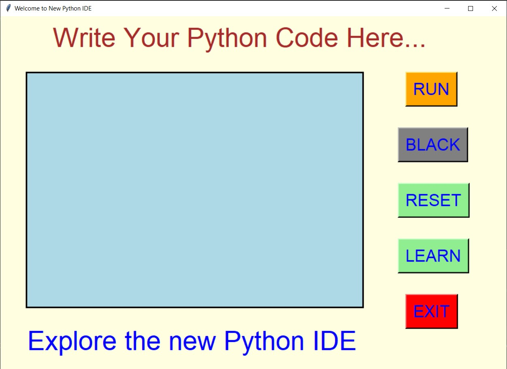
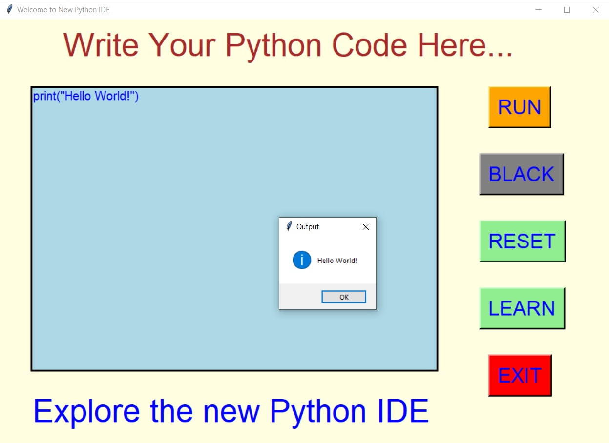
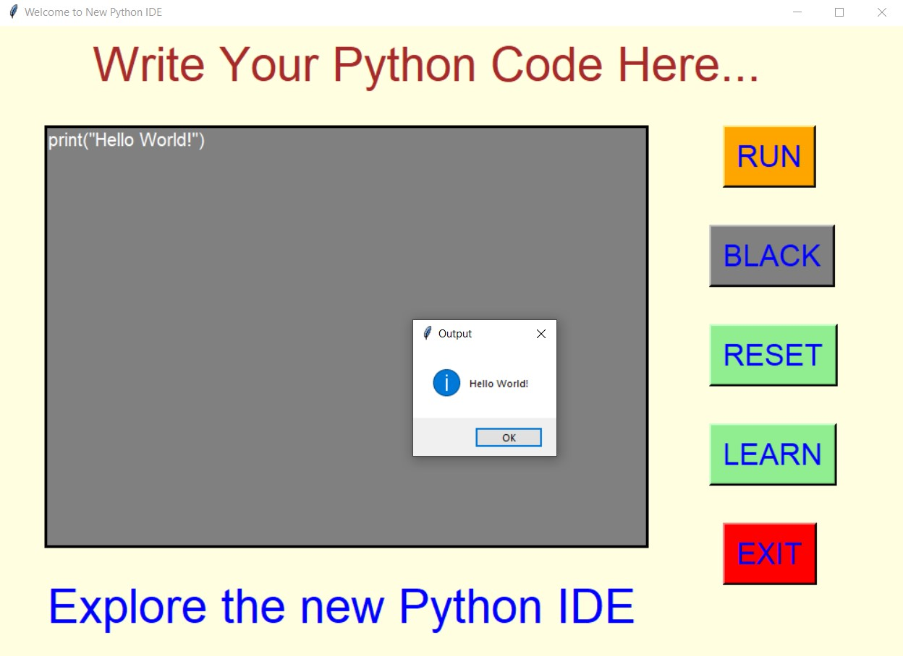
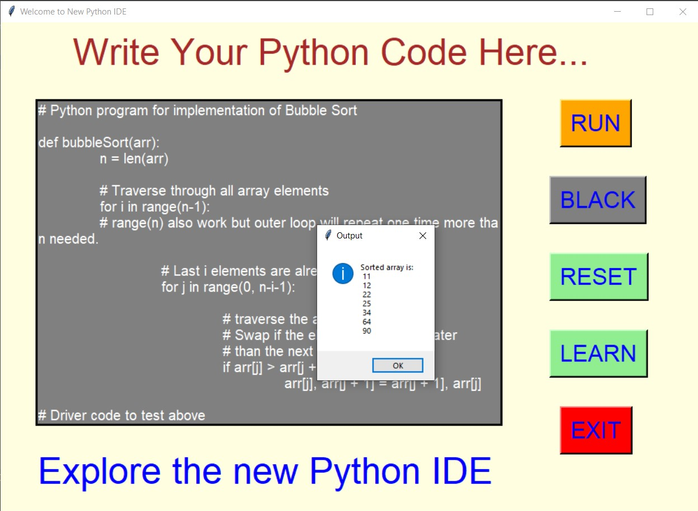
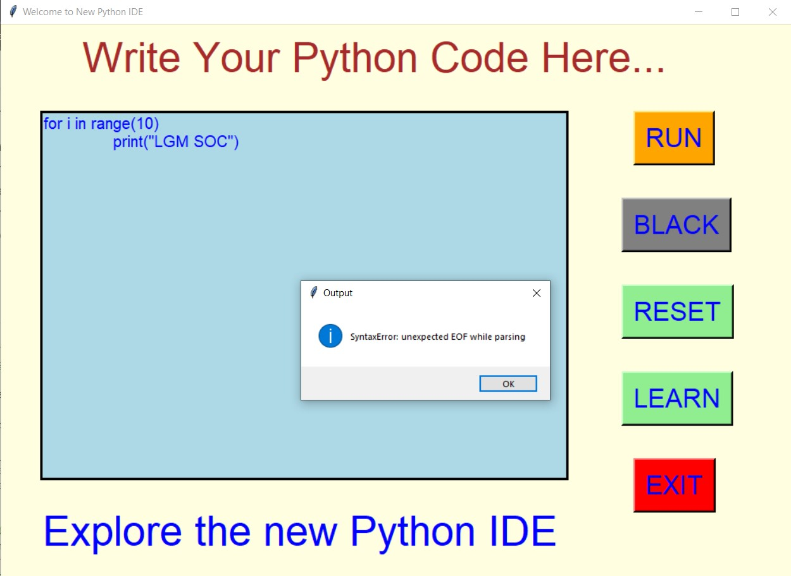
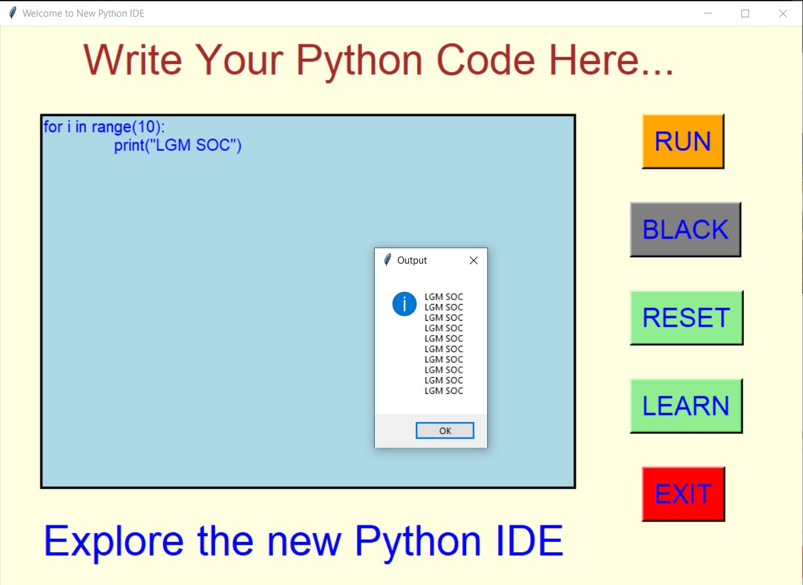
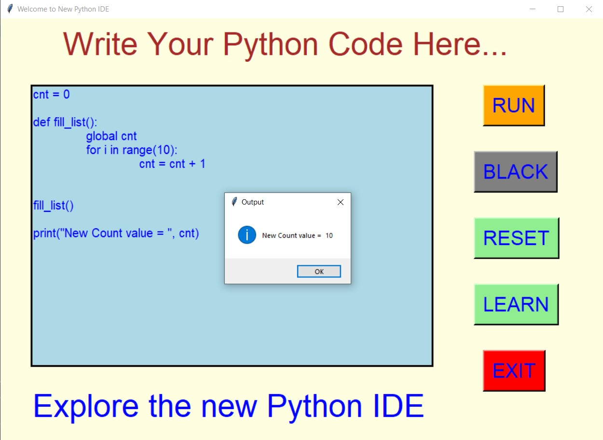
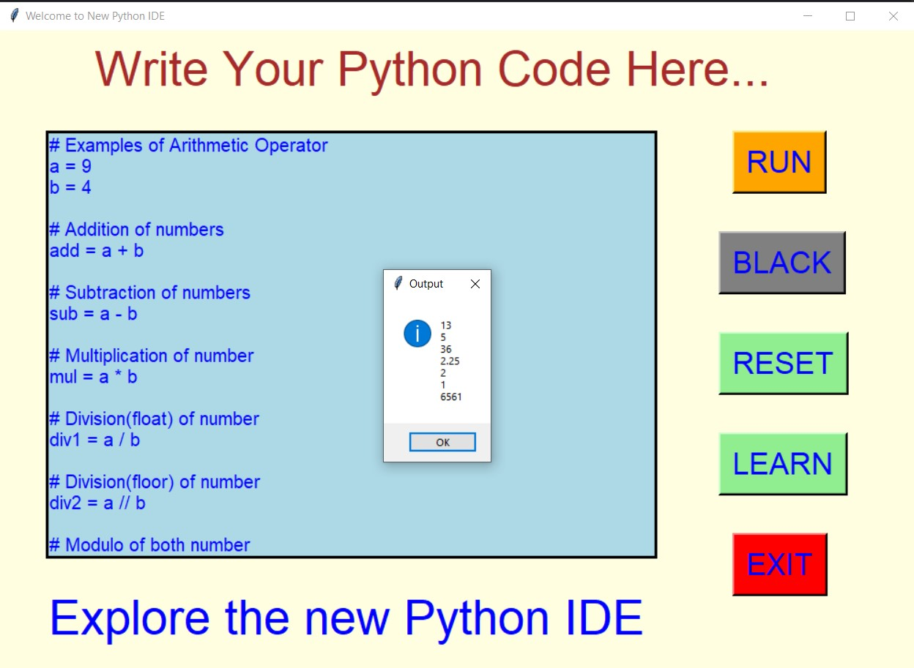
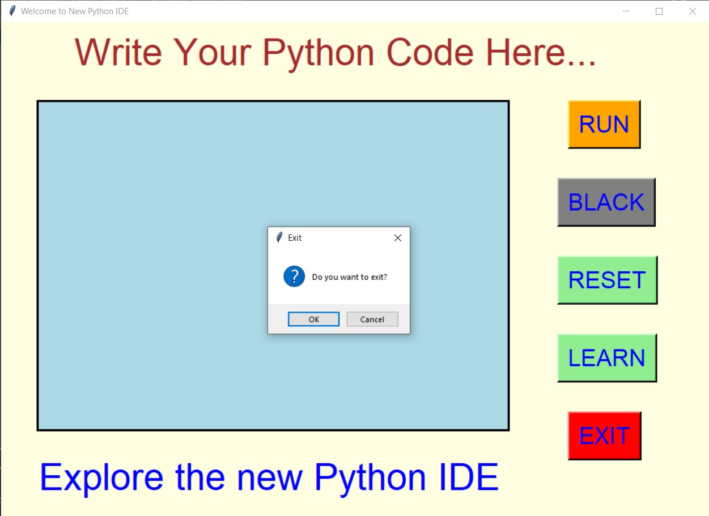

## ✔ SIMPLE PYTHON IDE
- A "Simple Python IDE" is an python IDE created in python with tkinter gui.
- In this IDE, user will be able to run python code and see the output in the message box, by clicking on the RUN button.
- Here user will also be able to change the background to black mode using the BLACK button.
- Using RESET button user can also clear the written code and reset the background of code area to normal background.
- Also there is a button LEARN, clicking on which a Geeks for Geeks - Python learning website will open.

****

### REQUIREMENTS :
- python 3
- tkinter module
- from tkinter messagebox module
- from io import StringIO
- webbrowser

****

### How this Script works :
- User just need to download the file and run the simple_python_ide.py on their local system.
- Now on the main window of the application the user needs to click on the start button to start coding in Python in new IDE.
- After clicking on START button, user will see the IDE, where one code area is given and several buttons are there.
- Now user can write any code in Python in that code area and click on the RUN button to run the program and see the output in messagebox.
- Also if there is some error in the written code, then also this IDE will show some error using messagebox.
- Also there is a BLACK button clicking on which changes the back ground color of code area to black.
- Also user can reset the background color of code area and clears the code using the RESET button.
- Also if user wants to learn python, then he can click on the LEARN button, and user will be taken to the Geeks for Geeks - Python learning website.
- Also there is an exit button, clicking on which exit dialog box appears asking for the permission of the user for closing the window.

### Purrpose :
- This scripts is basically a new IDE of python language where user can run and see the output of program.

### Compilation Steps :
- Install tkinter, io, webbrowser
- After that download the code file, and run simple_python_ide.py on local system.
- Then the script will start running and user can explore more about the new Python IDE by writing python code and running the code.

****

### SCREENSHOTS :

   
   
   
   
   
   
   
   
   
   
   
   

****

### Below is also a sample video of how this nre IDE works :

   

***

### Author :
- Akash Ramanand Rajak
