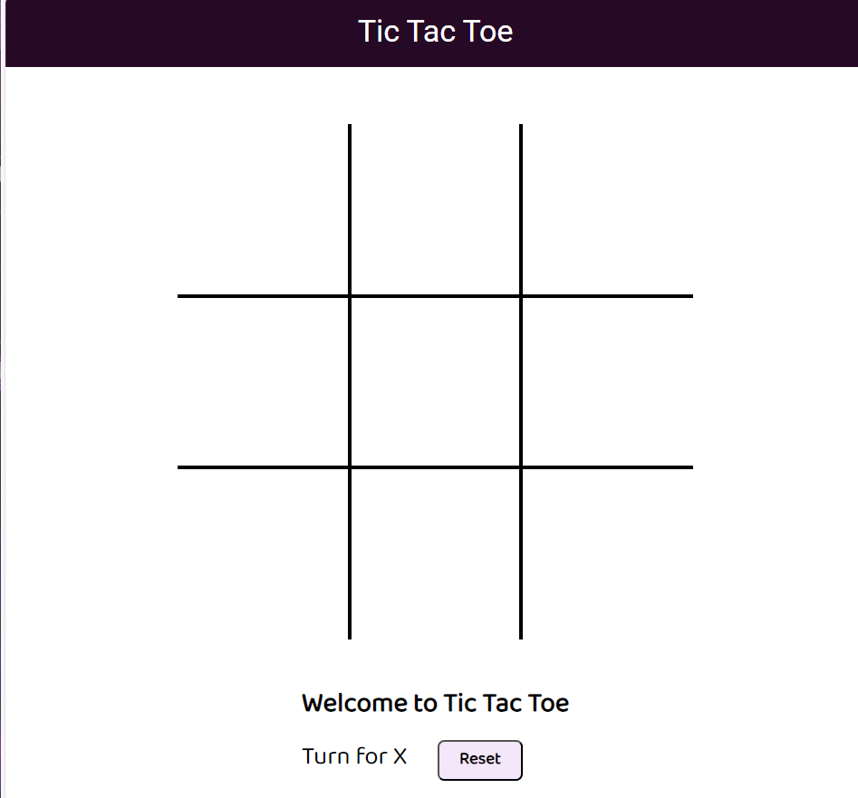

# Tic-Tac-Toe

## Introduction
The Tic Tac Toe Game is a simple web-based implementation of the classic Tic Tac Toe game. It allows two players to take turns marking 'X' or 'O' on a 3x3 grid. The game determines the winner based on a line of three identical symbols in a row, column, or diagonal, or declares a draw when the grid is filled without a winner.

## Technologies Used
- HTML
- CSS
- JavaScript

## Project Structure
- `index.html`: The main HTML file containing the game's user interface.
- `style.css`: The CSS file for styling the game interface.
- `script.js`: The JavaScript file containing the game logic and interactivity.

## Key Functionalities
- Player turns: The game alternates between 'X' and 'O' players for each move.
- Win Detection: The game detects a winning combination based on rows, columns, and diagonals.
- Draw Detection: The game detects a draw when all cells are filled without a winner.
- Restart: Players can restart the game at any time to start a new match.

## How the Tic Tac Toe Game Works
1. The game interface displays a 3x3 grid of buttons, representing the cells of the Tic Tac Toe board.
2. Two players take turns clicking on the buttons to place their symbol ('X' or 'O').
3. The game checks after each move for a winning combination or a draw.
4. If a player gets three of their symbols in a row, column, or diagonal, they win.
5. Players can restart the game by clicking the "Restart" button.
6. The game interface also includes a "New Game" button that resets the game and enables players to start a new match.

## Usage
1. Clone the repository using `git clone https://github.com/your-username/tic-tac-toe.git`.
2. Open `index.html` in a web browser to play the game, or click on the link at the bottom to open the github deployment.
3. Click on the buttons to make your moves and enjoy the game!

## Contributing
Contributions to this project are welcome! If you find any bugs or have suggestions for improvements, please open an issue or create a pull request.

<a href="https://shback007.github.io/Tic-Tac-Toe/" target="_blank">Game Link</a>
