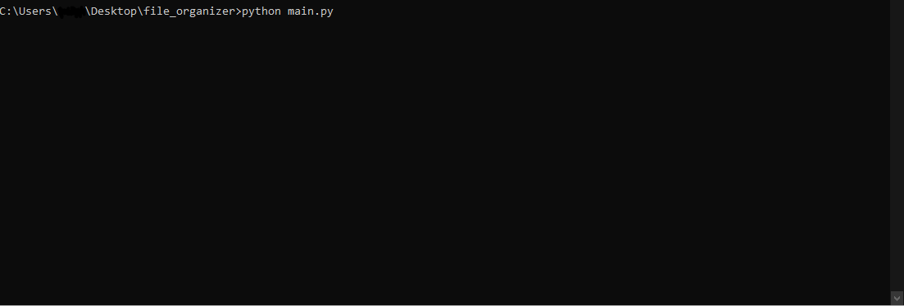

# Windows File Organizer
## Table Of Contents:

- ### 1. [Overview](#overview)
- ### 2. [Syntax](#how-to-use)
- ### 3. [Supported File types](#supported-file-types)

## Overview

Arranges files into folders based on their extension type .
Made with a tkinter user interface - Simple and straight to the point

No dependencies or additional libraries required.

[](https://www.python.org/)


---
## How to use
1. Start your favorite command-Line program

2. Change your current directory to where the project is saved.


3. Run the script
```shell 
   python main.py
```


4. Choose the source folder and the destination folder (target folder).


5. Press start and let it run !


6. You might be asked a few questions, if there is a possibility of 
overwriting. Act correspondingly to your required action.

7. You're done :)


## Supported File Types

There are around **1407** extensions currently supported.

### 1. Documents

### 2. Financial Records

### 3. Media 
   - 3d and cad files
   - Adobe -XD
   - Adobe - AfterEffects
   - Adobe - Director
   - Audio
   - Audio Editing
   - Images
   - Playlist
   - Video
   - Video Editing

### 4. Other
   - osu maps
   - Compressed
   - Desktop-Publishing
   - Disc
   - Encoded
   - Encrypted
   - Executable
   - Fonts
   - Internet-related
   - VMs (Virtual Machines)

### 5. Programming

   - ABAP
   - AGS Script
   - AMPL
   - ANTLR
   - APL
   - ASP
   - ActionScript
   - Ada
   - Agda
   - Alloy
   - AppleScript
   - Arc
   - Arduino
   - AspectJ
   - Assembly
   - Augeas
   - AutoHotKey
   - AutoIt
   - Awk
   - Batch File
   - Befunge
   - Bison
   - BlitzBasic
   - BlitzMax
   - Bluespec
   - Boo
   - BrightScript
   - Bro
   - C
   - C#
   - C++
   - C2hs Haskell

## Acknowledgments
 -   inspired by - https://github.com/sreekaransrinath/file_organizer 


 
**Made by: Ron Elgazar**

[Jump to the top](#table-of-contents)

